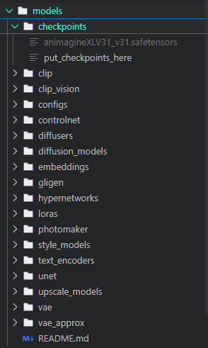
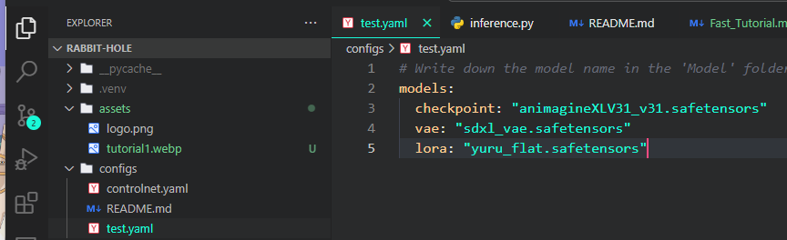

<p align="center">
  
</p>

# 🐰 Rabbit-Hole Fast Tutorial

Version : v0.1.0 

## 1. Environment Setup
Please set up the environment according to your system configuration.

### My Hardware & Software:
✅ `GPU`: Nvidia 4090, 24GB VRAM(Rabbit-Hole does not support `AMD` and `Intel` acceleration due to Python version issues.)

✅ `OS`: Windows 11

✅ `CUDA`: 12.4

✅ `cuDNN`: 8.9.7

### Dependencies Installation:
- Please refer to the [README.md](./README.md) for installation instructions.

- I recommend using ```SageAttention```. It significantly improves inference speed.

## 2. Downloading Models

You can download models from various sources.
Personally, I use **CivitAI** most often, but there are now many platforms that provide checkpoints. **HuggingFace** is also a solid choice.

Here are a few recommended sites:
- [CivitAI](https://civitai.com/)
- [HuggingFace](https://huggingface.co/models)
- [ModelScope](https://www.modelscope.cn/home)

Once downloaded, please place the model files into the appropriate subdirectories under the `models/` folder.
Note that in future updates, new model folders may be added.



There is ```REAME.md``` in ```models/``` too, so i think it would be good to read it.

## 3. Selecting Tunnels
This step is about selecting the ```Tunnel```, which you can think of as defining a single function.

At the beginning of a flow, the Tunnel should take **dynamic inputs** such as prompt, resolution, etc. and return some **intermediate or final output**, like an image. This output can either be saved or passed to another Tunnel for further processing.

The combinations of Tunnels are virtually limitless.
However, at this stage, only basic Tunnels that support ```SD 1.5``` to ```SDXL``` have been implemented.
Support for ```Flux```, ```SD3.5```, and more advanced models will be added in future updates.

If needed, feel free to create your own Tunnel by matching inputs and outputs carefully.

Writing a Tunnel can be easy or difficult depending on its purpose.
For model-related Tunnels, especially those dealing with tensors, you will need a solid understanding of ```PyTorch tensors``` and ```how models work under the hood```.

## 4. Creating a Custom Executor

Once you've selected your Tunnels and designed your workflow, the next step is to wrap it into an ```Executor```.

You can think of an Executor as an `instance that loads the model and exposes the workflow through a single callable method` based on input. This instance can be used in various services, including:

- **API-based image generation services**

- **Integration as a Tool in LangChain or other LLM frameworks**

- **Building more complex multimodal pipelines** through chaining multiple Executors

Each Executor uses configuration files under the ```configs/``` directory to define static parameters for initialization.



The basic format of an Executor:

- ```__init__```: Loads the model and sets fixed parameters

- ```__call__```: Performs inference

You may also define additional methods if needed, depending on the complexity or extensibility of your use case.


## 5. Using Executors
In this section, we'll test a few custom Executors that I created for demonstration purposes.

```shell
# In Python Virtual Env
python inference.py --fast --use-sage-attention --config-path configs/test.yaml
or
python3 inference.py --fast --use-sage-attention --config-path configs/test.yaml
```

### 5.1 T2IExecutor

```T2IExecutor``` is the most basic executor. It simply generates an image based on a given text prompt.

- ```__init__``` setup:

    - ```load_checkpoint```: Loads the base checkpoint model

    - ```clip_skip```: Applies CLIP skip for encoder tweaking

    - ```load_vae```: Loads the VAE module
- ```__call__``` execution flow:

    - ```encode_SDXL```: Encodes the prompt using the SDXL CLIP encoder

    - ```empty_latent```: Generates an empty latent tensor with the specified width and height

    - ```ksampler```: Performs inference using the model, sampler, scheduler, and related parameters

    - ```vae_decode```: Decodes the generated latent into pixel space

    - ```save_image```: Saves the final image to disk


### 5.2 T2IHireFixExecutor

```T2IHireFixExecutor``` extends the basic T2I pipeline by applying **high-resolution (hires) fixing** after the initial image generation. This improves detail and image quality.

- ```__init__``` setup:

  - ```load_checkpoint```: Loads the base model

  - ```clip_skip```: Applies CLIP skip with a value of 2

  - ```load_vae```: Loads the VAE module

- ```__call__``` execution flow:

  - ```encode_SDXL```: Encodes both positive and negative prompts
  
  - ```empty_latent```: Creates a blank latent tensor based on resolution
  
  - ```ksampler```: Runs inference to generate an initial latent
  
  - ```hires_fix```: Upscales and refines the initial latent output
  
  - ```vae_decode```: Decodes the final latent into image pixels

  - ```save_images```: Saves the result to disk
  - Logs the inference time

This Executor is useful when you want better resolution and detail enhancement through a secondary pass.


### 5.3 T2ILoRAExecutor

`T2ILoRAExecutor` integrates **LoRA (Low-Rank Adaptation)** weights into the inference process, allowing for fine-tuned or domain-specific generation.

**`__init__` setup:**

* `load_checkpoint`: Loads the base model
* `clip_skip`: Applies CLIP skip with a value of 2
* `load_lora`: Injects LoRA weights into the model and encoder
* `load_vae`: Loads the VAE module

**`__call__` execution flow:**

* `encode_SDXL`: Encodes prompts using the modified CLIP
* `empty_latent`: Initializes an empty latent tensor
* `ksampler`: Performs inference with LoRA-injected weights
* `vae_decode`: Converts the latent into an image
* `save_images`: Outputs the image to disk
* Logs total inference time

This Executor is useful for experiments with **custom-trained LoRA models** or **fine-grained control** over generation style.


### 5.4 IT2IExecutor (With ControlNet + Upscaling + LoRA)

```IT2IExecutor``` combines ``ControlNet```, ```Upscaling```, and ```LoRA``` in a single pipeline.  
It accepts both an input image (used for Canny edge detection) and a text prompt, and generates an image that aligns with the structure of the input while reflecting the prompt’s content.

This executor is ideal for structured generation tasks—such as turning a sketch or edge map into a high-quality image—while preserving fine control over style and resolution.

```__init__``` setup:

  - ```load_checkpoint```: Loads the base diffusion model  

  - ```clip_skip```: Applies CLIP skip (e.g., skip 2)  

  - ```load_lora```: Applies a LoRA adapter to the model  

  - ```load_vae```: Loads the VAE  

  - ```load_control_net```: Loads the ControlNet model for edge-based guidance  

  - ```load_upscale_model```: Loads the model for final resolution upscaling  

  - ```Processor().canny```: Initializes the Canny edge detector

```__call__``` execution flow:

  - ```load_image_from_path```: Loads the input image  

  - ```enhance_hint_image```: Prepares the image for Canny detection (e.g., Resize and Fill)  

  - ```canny```: Generates the edge map for ControlNet  

  - ```encode_SDXL```: Encodes both positive and negative prompts  

  - ```apply_controlnet```: Applies ControlNet conditioning with the Canny image  

  - ```empty_rgb``` + ```vae_encode```: Creates and encodes a blank white latent as the starting point  

  - ```ksampler```: Runs the inference with ControlNet + LoRA guidance  

  - ```vae_decode```: Decodes the result from latent to image  

  - ```enhance_hint_image```: Resizes and crops the final image to match original proportions  

  - ```upscale_by_model```: Applies final upscaling for higher resolution  

  - ```save_images```: Saves the output image to disk  

  - Logs total inference time


