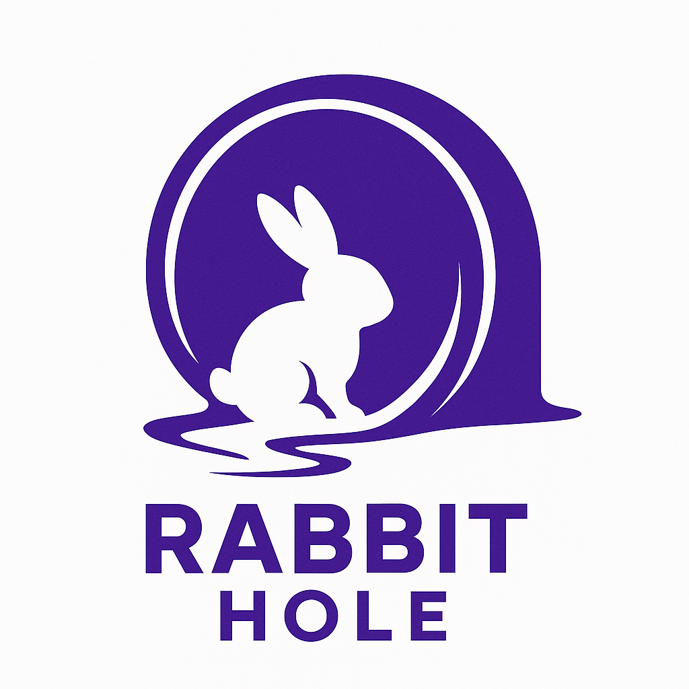

<div align="center">
<p align="center">
  
</p>

# Rabbit Hole

[](https://github.com/pupba/rabbit_hole/releases)
[](https://github.com/pupba/rabbit_hole/stargazers)
[](https://github.com/pupba/rabbit_hole/LICENSE)


**Enterprise Custom Image Generation Pipeline**  
**Inspired by ComfyUI, Reimagined for Production**
</div>

---

### Why rabbit_hole?  
rabbit_hole was created to bring powerful, **customizable image generation** pipelines into enterprise and research environments.  
While [ComfyUI](https://github.com/comfyanonymous/ComfyUI) is highly visual and flexible, it has limitations for production use:
- Node development is complex and not easily extensible.
- Workflow customization requires internal code changes.
- Integration with external Python libraries is difficult.
- Maintaining reproducibility, batch operations, and versioned config is not straightforward.

**rabbit_hole** was built to solve these, enabling rapid, modular, and automated workflows—fully in Python and easy to extend.

---

## Features

- **Composable Pipeline Building**  
  Build custom flows as Python classes by connecting modular tunnel steps.
- **YAML Configuration**  
  Use static, version-controlled YAML files for models, runtime, and batch settings.
- **Batch & Automation Ready**  
  CLI and API friendly—ideal for MLOps, research, and cloud-scale workflows.
- **Model Agnostic & Extensible**  
  Easily swap or extend with custom models, samplers, or encoders.
- **Production Focus**  
  Robust logging, memory management, and CUDA setup for reliability.
---

## Directory Structure

```
rabbit_hole/
├── assets/ # Project assets (e.g. logo, example images)
├── configs/ # YAML config files (static settings, models)
├── cores/ # Core utility modules (ComfyUI-adapted, may be replaced)
├── defaults/ # Logging, CUDA, and default environment setup
├── examples/ # Example results
├── executors/ # Custom flow classes—your inference logic
├── models/ # Model weights/checkpoints by type
├── tools/ # Utilities for image/latent/tensor ops
├── tunnels/ # Modular, reusable pipeline steps
├── inference.py # Main pipeline entry point
├── pyproject.toml
├── README.md
├── requirements.txt
```


---

## Quick Start

> **Tested Environment**: CUDA 12.4, Python 3.12, torch 2.6.0+cu124

```shell
# 1. Python environment setup
uv init --bare --python 3.12
uv sync --python 3.12

# 2. Activate venv
source .venv/bin/activate      # Linux & Mac
.venv\Scripts\activate        # Windows

# 3. Install requirements
uv pip install -r requirements.txt

# 4. (Recommended) Install CUDA/PyTorch stack
uv pip install torch==2.6.0+cu124 torchvision==0.21.0+cu124 torchaudio==2.6.0+cu124 xformers==0.0.29.post3 --index-url https://download.pytorch.org/whl/cu124
uv pip install triton-windows==3.2.0.post18   # (Windows only)
uv pip install triton==3.2.0  # (Linux/Mac)
```

### Recommended Inference Launch
```shell
python -m inference --fast --use-sage-attention
# or
python3 -m inference --fast --use-sage-attention
```
> Tune options and config path as needed.
> See configs/README.md for YAML configuration.

### Example: Build a Flow
```python
from executors.example_text_to_image import T2IExecutor

executor = T2IExecutor()
executor(
        "1girl, izayoi sakuya, touhou, solo, maid headdress, maid, apron, short sleeves, dress, closed mouth, white apron, looking at viewer, maid apron, puffy short sleeves, frills, puffy sleeves, black dress, frilled apron, hair between eyes, outdoors, blush, throwing knives, knives, serious face, upper body, masterpiece, best quality, very aesthetic, absurdres",
        "wings, nsfw, low quality, worst quality, normal quality,",
        1024,
        1024,
        20,
        7.0,
        1241234454,
    )
```
### Result Examples

| Executor         | Result                                    |
|------------------|-------------------------------------------|
| T2IExecutor      |                      |
| T2IHireFixExecutor  |                  |
| T2ILoRAExecutor  |                  |
| IT2IExecutor  |                  |

## Contributing

We welcome contributions!  
To get started:

1. **Fork** this repository.
2. **Create a new branch** for your feature, fix, or improvement.
3. **Make your changes** (add a Tunnel, Tool, bug fix, etc).
4. **Open a Pull Request (PR)** to the main branch.
5. Your PR will be reviewed and, once approved, merged.
6. You’ll be listed as a project contributor!

For detailed guidelines, see [CONTRIBUTING.md](CONTRIBUTING.md).

## ToDo

- [x] **Publish core inference code**
- [ ] **Add FastAPI + Queue based asynchronous generation pipeline**
- [ ] **Implement LLM and external API tunnels**
- [ ] **Publish a paper**

## References

- [ComfyUI GitHub](https://github.com/comfyanonymous/ComfyUI)
- [ComfyUI Documentation](https://github.com/comfyanonymous/ComfyUI/wiki)

<div>
<a href="https://www.buymeacoffee.com/pupba"></a>
</div>